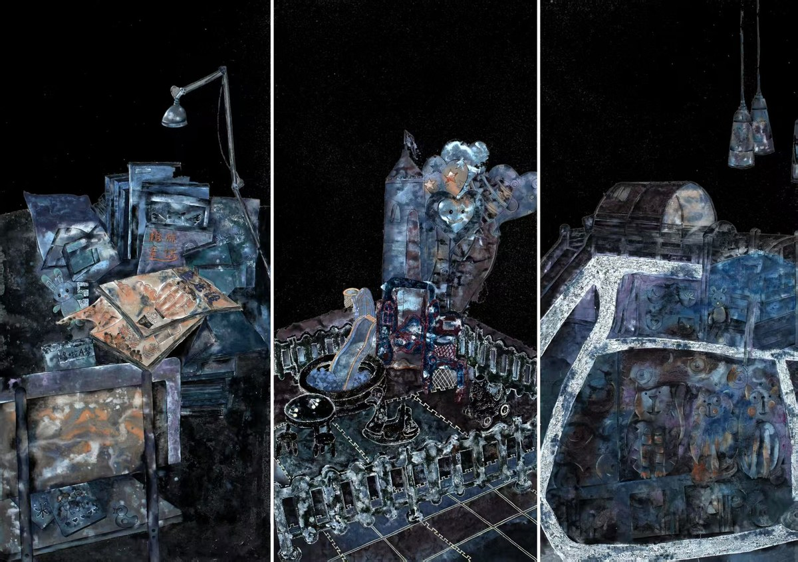
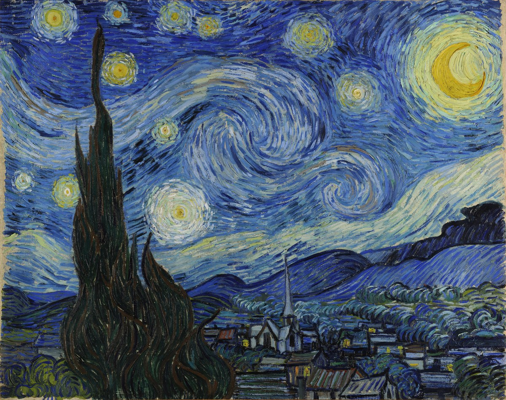
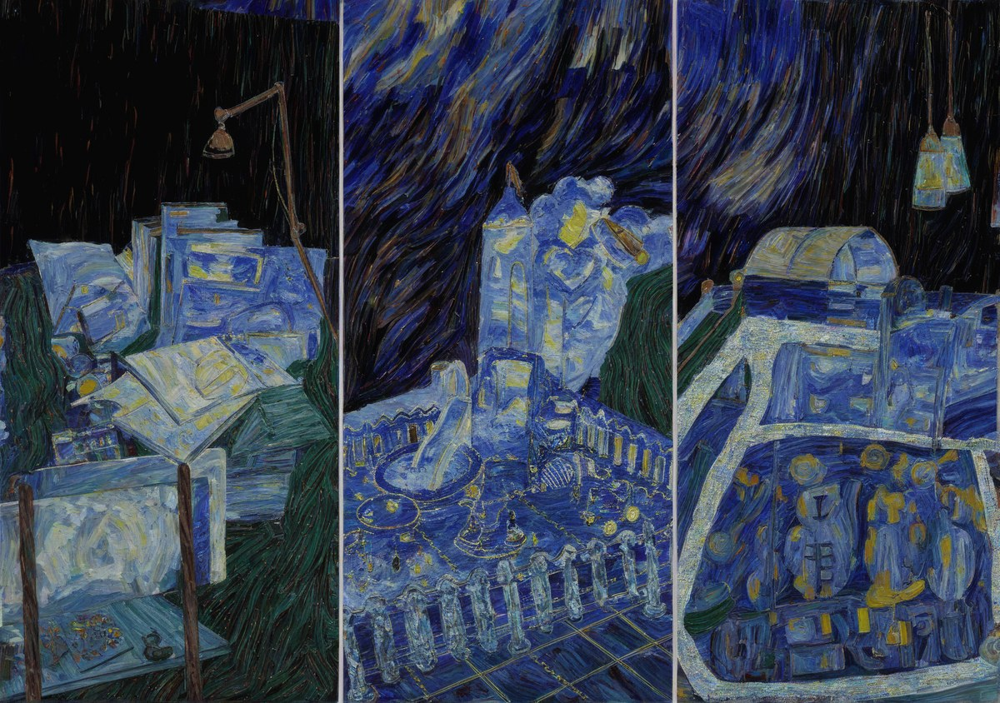

# AI Video Agent

Version: **1.0.0**

AI Video Agent 是一个 Windows 本地创作 Agent，包含两个核心模式：

1. **视频剪辑**：用户选择素材文件夹、BGM 文件夹和输出文件夹，填写想要的成片风格、关键帧要求和重点内容要求。Agent 会先做轻量视频分析，再调用用户自己的 OpenAI-compatible 文本大模型生成剪辑方案，最后优先调用 DaVinci Resolve，失败时自动回退到 FFmpeg。
2. **图片生成**：使用本地 SDXL + IP-Adapter + ControlNet 工作流，支持文生图、参考图风格迁移、保留内容改风格。DashScope/Qwen 可选用于风格参考图分析和提示词改写。

仓库只保留应用代码、安装配置和说明文档；本地素材、输出结果、模型权重、缓存、字幕和时间线会被 `.gitignore` 忽略。

## 功能概览

- Windows 桌面窗口界面，默认中文。
- 视频剪辑支持 DeepSeek、OpenAI、OpenRouter、硅基流动等 OpenAI-compatible Chat API。
- 支持选择任意素材文件夹、BGM 文件夹和输出文件夹。
- 视频剪辑会输出成片、剪辑脚本、字幕、timeline、运行报告和算法分析报告。
- 轻量算法优化：候选片段切分、清晰度评分、运动量评分、音频能量评分、高光片段排序、时间线修正。
- 图片生成使用本地模型：
  - SDXL 文生图。
  - IP-Adapter 注入风格参考图。
  - ControlNet Canny 保持内容图结构。
  - DashScope/Qwen 可选做风格图分析和 prompt 改写。
  - 参考图风格迁移支持按内容图自动设置生成尺寸，并对超大图做安全等比缩放。

### 图片风格转换示例

下例展示“参考图风格迁移”：图一作为内容图片，图二作为风格图片，图三是将内容图更换为参考画风后的结果。

| 图一：内容图片 | 图二：风格图片 | 图三：转换结果 |
| --- | --- | --- |
|  |  |  |

## 环境要求

- Windows 10/11
- Python 3.10+，推荐 3.10、3.11 或 3.12
- pip
- NVIDIA 显卡推荐 8GB 显存以上；低显存可运行但会更慢
- FFmpeg：用于视频分析和 FFmpeg 后备渲染
- 可选：DaVinci Resolve，并开启本地脚本接口

## 安装

```powershell
git clone https://github.com/dongdoublez66-create/AI-Video-Agent.git
cd AI-Video-Agent
python -m venv .venv
.\.venv\Scripts\Activate.ps1
python -m pip install --upgrade pip
```

如果需要 GPU 加速，先安装与你显卡驱动匹配的 PyTorch CUDA 版。下面是 CUDA 12.1 示例：

```powershell
python -m pip install torch torchvision torchaudio --index-url https://download.pytorch.org/whl/cu121
```

再安装项目依赖：

```powershell
python -m pip install -r requirements.txt
python -m pip install -e .
```

如果 Hugging Face 模型下载慢，可以在启动前设置镜像：

```powershell
$env:HF_ENDPOINT="https://hf-mirror.com"
```

## 启动

源码方式：

```powershell
python -m ai_video_agent gui
```

安装后也可以使用命令：

```powershell
ai-video-agent-gui
```

检查本地依赖：

```powershell
python -m ai_video_agent doctor
```

初始化本地工作目录：

```powershell
python -m ai_video_agent init
```

## API 配置

### 视频剪辑 API

视频剪辑需要文本大模型 API。DeepSeek 示例：

```text
Base URL: https://api.deepseek.com/v1
Model: deepseek-chat
```

也可以使用其他 OpenAI-compatible Chat API，只要支持 `/chat/completions`。

### 图片生成 API

图片主体生成在本地完成，不再需要 OpenAI、MiniMax、ComfyUI 或 ChordEdit 图片后端。

DashScope API Key 是可选项，只用于：

- 分析风格参考图。
- 将中文需求改写为更适合 SDXL 的英文 positive/negative prompt。

可以在图片生成页直接填写，也可以使用环境变量：

```powershell
setx DASHSCOPE_API_KEY YOUR_DASHSCOPE_KEY
```

## 使用方式

### 视频剪辑

1. 打开应用，进入“视频剪辑”。
2. 填写 Base URL、API Key 和模型名。
3. 点击“验证剪辑 API”。
4. 选择素材文件夹、BGM 文件夹和输出文件夹。
5. 填写视频风格、关键帧补充、重点内容剪辑方式。
6. 建议保持“启用算法优化”开启。
7. 点击“剪辑视频”。

### 图片生成

1. 打开应用，进入“图片生成”。
2. 选择生成方式：
   - **文生图**：只根据文字生成图片，也可以额外提供风格参考图。
   - **参考图风格迁移**：选择一张内容图片和一张风格参考图，尽量保留内容结构并迁移画风。
   - **保留内容改风格**：选择内容图片，用文字描述要改成的风格。
3. 可选填写 DashScope Key，开启智能风格分析和提示词改写。
4. 设置输出文件夹、尺寸、数量、采样步数、seed、重绘强度、风格注入强度。
5. 点击“生成图片”。

第一次运行图片生成时会下载 SDXL、ControlNet 和 IP-Adapter 模型，耗时较长。后续会复用本地缓存。

## 命令行图片生成示例

文生图：

```powershell
python -m ai_video_agent image `
  --mode text_to_image `
  --prompt "一幅未来城市夜景，电影感，高细节" `
  --out-dir outputs/images
```

参考图风格迁移：

```powershell
python -m ai_video_agent image `
  --mode style_reference `
  --prompt "保留内容图主体和构图，改成参考图的画作风格" `
  --content-image inputs/images/content.png `
  --style-reference-image inputs/images/style.png `
  --dashscope-api-key $env:DASHSCOPE_API_KEY
```

## 项目结构

```text
ai_video_agent/
  __main__.py              # python -m ai_video_agent 入口
  cli.py                   # 命令行入口
  gui.py                   # Windows 桌面界面
  agent.py                 # 视频剪辑主流程
  llm.py                   # OpenAI-compatible Chat API 客户端
  video_analysis.py        # 轻量视频分析
  timeline_optimizer.py    # 时间线算法优化
  image_agent.py           # 本地 SDXL 图片生成流程
  image_llm.py             # DashScope/Qwen 风格分析和 prompt 改写
requirements.txt           # pip 依赖
pyproject.toml             # 本地安装配置
README.md                  # 使用说明
.gitignore                 # 忽略本地素材、输出、模型、缓存和密钥
```

## 注意事项

- 不要把 API Key 写进代码或提交到仓库。
- 图片生成默认使用本地模型；显存不足时可以降低尺寸、采样步数和生成数量。
- DaVinci Resolve 不可用时，视频剪辑会尝试自动回退到 FFmpeg。
